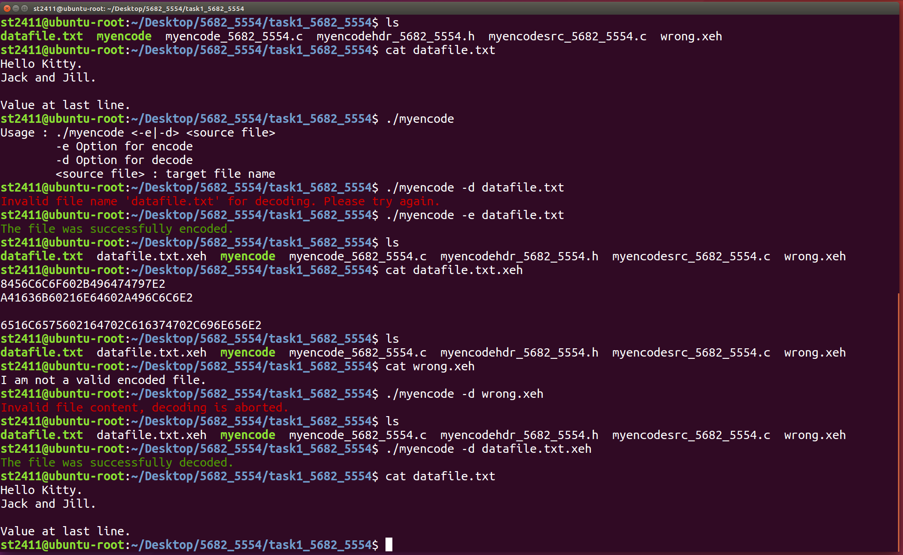

# Txt Encoder and Decoder

***Txt Encoder and Decoder*** ia a C program to encode or decode a text file based on an obfuscation scheme. 

For encoding, the program reads in the content of a text file and first converts each character of the text file into the corresponding 
2-digit hexadecimal string. E.g. an 'A' will be converted to '41'.  The program will then swap the 2 digits of the (in order to hide the 
real value). Ie.  An 'A' will be encoded to '14'.

For decoding, the program will just reverse the encoding scheme and convert a sequence of encoded string into the original text. 

## Preview

## Usage

1. Clone this repository into any directory. 

2. Enter the "txt-encoder-decoder" directory by typing `cd txt-encoder-decoder`.

3. Compile the program by typing `gcc myencode.c myencodesrc.c -o myencode -Wall`. 

4. Run the program by typing `./myencode`.

## Acknowledgments

- **Darren Chua** | [@chydarren](https://github.com/chydarren)
- **Chng Wei Cheng**

## Credits

This program was developed as an assignment for the Singapore Polytechnic, ST2411 Programming in Python and C module. I have uploaded the source files publicly for reference and personal usage only. Please refrain from [plagiarising](https://www.sp.edu.sg/sp/student-services/ssc-overview/student-handbook/intellectual-property-copyright-and-plagiarism) or passing it off as your own work. 

Chua Han Yong Darren © 2017. Code released under the GNU Affero General Public License v3.0.
